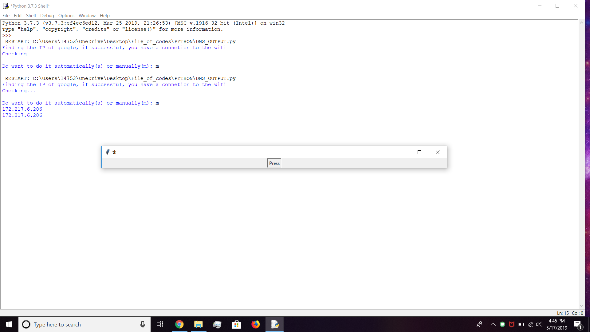
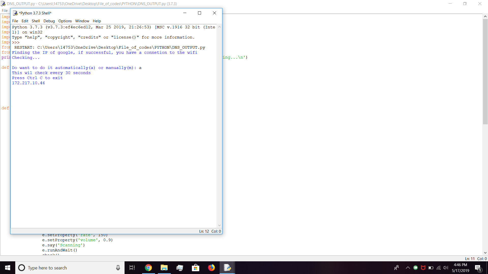

# DNS_Checker
Purpose:

Checks if you have a connection to the internet by checking for the D.N.S. connection to google  

Requirments:

-----------------------------------------------

python -m pip install schedule 

python -m pip install pyttsx3

-----------------------------------------------

Usage:

After you have installed/copied the code all you now need to do is run this code in cmd and it will check every 30 seconds or on command(your choice)

This is the image of the manual use

This is the image of the automatic use

**All credit goes to / Created by: Raj 

